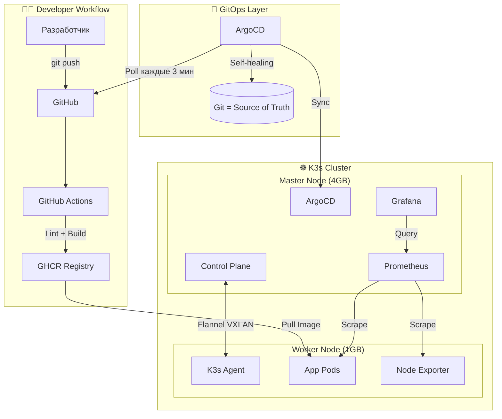
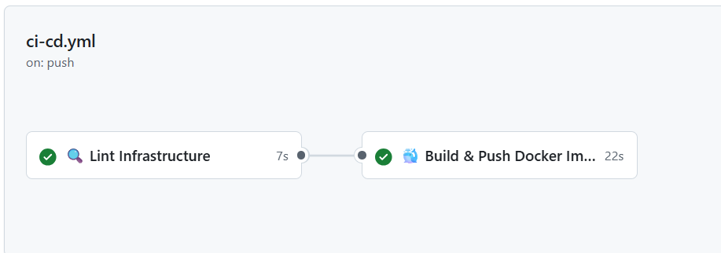
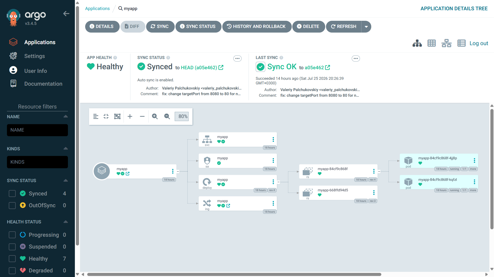
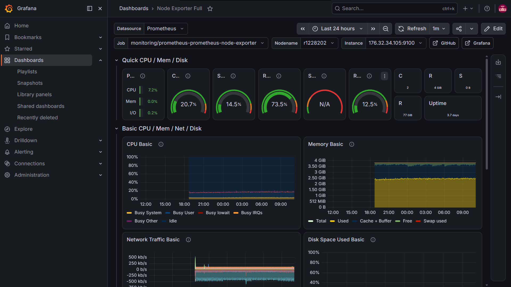
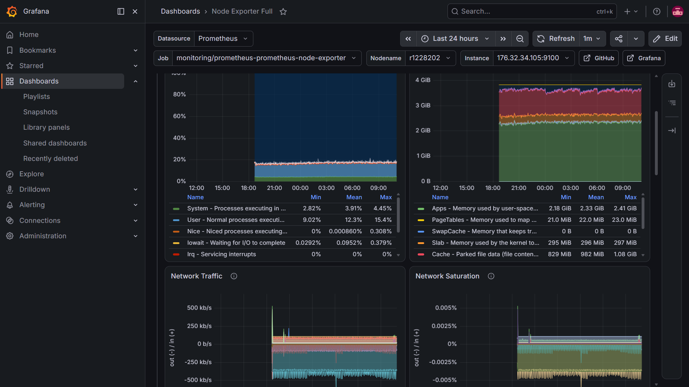
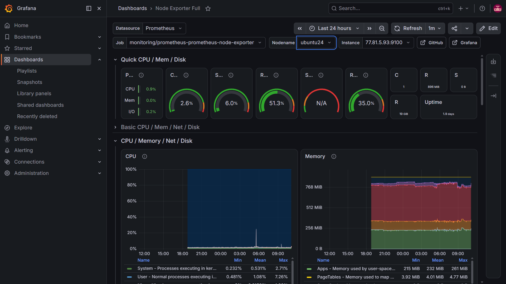
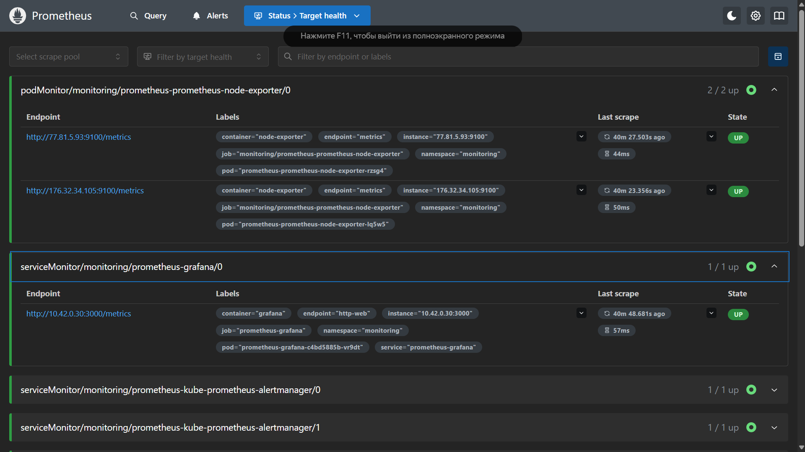
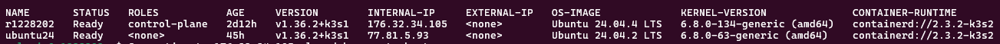

```markdown
<div align="center">

# 🚀 K3s Platform

### Production-Ready Kubernetes GitOps Platform

[](https://github.com/valeriypalchukovskiy/k3s-platform/actions)


**От `git push` до production за 3 минуты, полностью автоматически.**

</div>

---

## 🎯 Обзор

Полноценная DevOps-платформа, реализующая современные практики:

- 🏗️ **Infrastructure as Code** — Ansible для настройки серверов
- 🔄 **GitOps** — ArgoCD для декларативного деплоя
- ⚙️ **CI/CD** — GitHub Actions для автоматизации
- 📊 **Observability** — Prometheus + Grafana для мониторинга
- 🔒 **Security** — UFW, Fail2Ban, SSH hardening

---

## 🏛️ Архитектура



---

## 🛠️ Технологический стек

| Категория | Технология | Назначение |
|-----------|------------|------------|
| **Orchestration** | K3s | Lightweight Kubernetes |
| **GitOps** | ArgoCD | Декларативный деплой |
| **CI/CD** | GitHub Actions | Автоматизация сборки |
| **Registry** | GHCR | Хранилище Docker-образов |
| **Packaging** | Helm 3 | Пакетный менеджер K8s |
| **Monitoring** | Prometheus + Grafana | Метрики и визуализация |
| **Networking** | Flannel VXLAN | Overlay сеть |
| **Security** | UFW, Fail2Ban | Hardening серверов |
| **IaC** | Ansible | Настройка серверов |

---

## 📸 Скриншоты

| CI/CD Pipeline | GitOps Dashboard |
|:--------------:|:----------------:|
|  |  |

| Monitoring | Prometheus Targets |
|:----------:|:------------------:|
|  |  |

| Kubernetes Cluster | Running Pods | Deployed App |
|:------------------:|:------------:|:------------:|
|  |  |  |

---

## ✅ Что реализовано

### 🏗️ Инфраструктура

- Multi-Node K3s кластер на 2 VPS (Master + Worker)
- Overlay сеть через Flannel VXLAN
- Linux hardening: UFW firewall, Fail2Ban, SSH keys only
- Ansible playbooks для автоматической настройки серверов

### 🔄 CI/CD Pipeline

- GitHub Actions workflow с stages: `lint` → `build` → `push`
- Helm lint и YAML validation на каждый PR
- Docker multi-stage build с оптимизацией слоёв
- Автоматические теги (SHA коммита + `latest`)

### 🎯 GitOps

- ArgoCD с автоматической синхронизацией каждые 3 минуты
- Self-healing — ручные изменения откатываются автоматически
- Health checks и статусы синхронизации в UI

### 📊 Observability

- Prometheus со сбором метрик с обеих нод
- Grafana с 15+ импортированными дашбордами (1860, 315, 6417)
- Node Exporter + kube-state-metrics + cAdvisor

### 🛡️ Отказоустойчивость

- Автоматический rescheduling подов при падении ноды
- Zero-downtime rolling updates
- Git-based rollback через `git revert`

---

## 🎬 Как это работает

```bash
# 1. Разработчик вносит изменения
git commit -m "feat: add new feature"
git push origin main

# 2. GitHub Actions автоматически:
#    - Проверяет Helm charts (lint)
#    - Собирает Docker-образ
#    - Пушит в GHCR

# 3. ArgoCD видит изменения в Git и применяет:
#    - Обновляет Deployment в кластере
#    - Rolling update без простоя

# 4. Через 3 минуты приложение работает с новой версией ✨
```

---

## 📂 Структура проекта

```
k3s-platform/
├── 📁 .github/
│   └── 📁 workflows/
│       └── 📄 ci-cd.yml              # CI/CD pipeline
│
├── 📁 app/
│   ├── 📄 Dockerfile                 # Docker-образ приложения
│   ├── 📄 index.html                 # Кастомная landing page
│   └── 📄 nginx.conf                 # Конфигурация nginx
│
├── 📁 helm/
│   └── 📁 myapp/
│       ├── 📄 Chart.yaml             # Метаданные Helm chart
│       ├── 📄 values.yaml            # Параметры деплоя
│       └── 📁 templates/             # K8s манифесты (шаблоны)
│
├── 📁 manifests/
│   └── 📁 argocd/                    # ArgoCD Applications
│
├── 📁 screenshots/                   # Скриншоты для README
└── 📄 README.md
```

---

## 🚀 Быстрый старт

### Требования

- 2 VPS сервера (Ubuntu 22.04+, 4GB + 1GB RAM)
- `kubectl`, `helm` установлены локально
- GitHub аккаунт

### 1. Установи K3s

```bash
# На Master-ноде
curl -sfL https://get.k3s.io | sh -s - server \
  --disable=traefik \
  --flannel-backend=vxlan

# На Worker-ноде
curl -sfL https://get.k3s.io | \
  K3S_URL=https://<master-ip>:6443 \
  K3S_TOKEN=<token> sh -
```

### 2. Установи ArgoCD

```bash
kubectl create namespace argocd
kubectl apply -n argocd -f \
  https://raw.githubusercontent.com/argoproj/argo-cd/stable/manifests/install.yaml
```

### 3. Задеплой приложение

```bash
kubectl apply -f manifests/argocd/myapp.yaml
```

### 4. Установи мониторинг

```bash
helm repo add prometheus-community \
  https://prometheus-community.github.io/helm-charts

helm install prometheus prometheus-community/kube-prometheus-stack \
  -n monitoring --create-namespace
```

---

## 🎓 Чему я научился

| Навык | Уровень |
|-------|---------|
| Kubernetes (Multi-Node) | ⭐⭐⭐⭐ |
| GitOps (ArgoCD) | ⭐⭐⭐⭐⭐ |
| CI/CD (GitHub Actions) | ⭐⭐⭐⭐ |
| Helm (packaging) | ⭐⭐⭐⭐ |
| Monitoring (Prometheus + Grafana) | ⭐⭐⭐⭐ |
| Linux Hardening | ⭐⭐⭐ |

---

## 🗺️ Roadmap

- [ ] 🔐 **Vaultwarden** — self-hosted password manager
- [ ] 📬 **Telegram alerts** через Alertmanager
- [ ] 📝 **Loki** для централизованных логов
- [ ] 🔒 **cert-manager** + Let's Encrypt
- [ ] 🦊 **GitLab CI** — гибридный CI/CD
- [ ] 🕸️ **Service Mesh** (Istio / Linkerd)

---

## 👤 Автор

**Valeriy Palchukovskiy**

[](https://github.com/valeriypalchukovskiy)
[](mailto:valeriy_palchukovskiy@mail.ru)

---

<div align="center">

**⭐ Если проект был полезен — поставь звезду!**

Made with ❤️ and lots of `kubectl` commands

</div>
```
